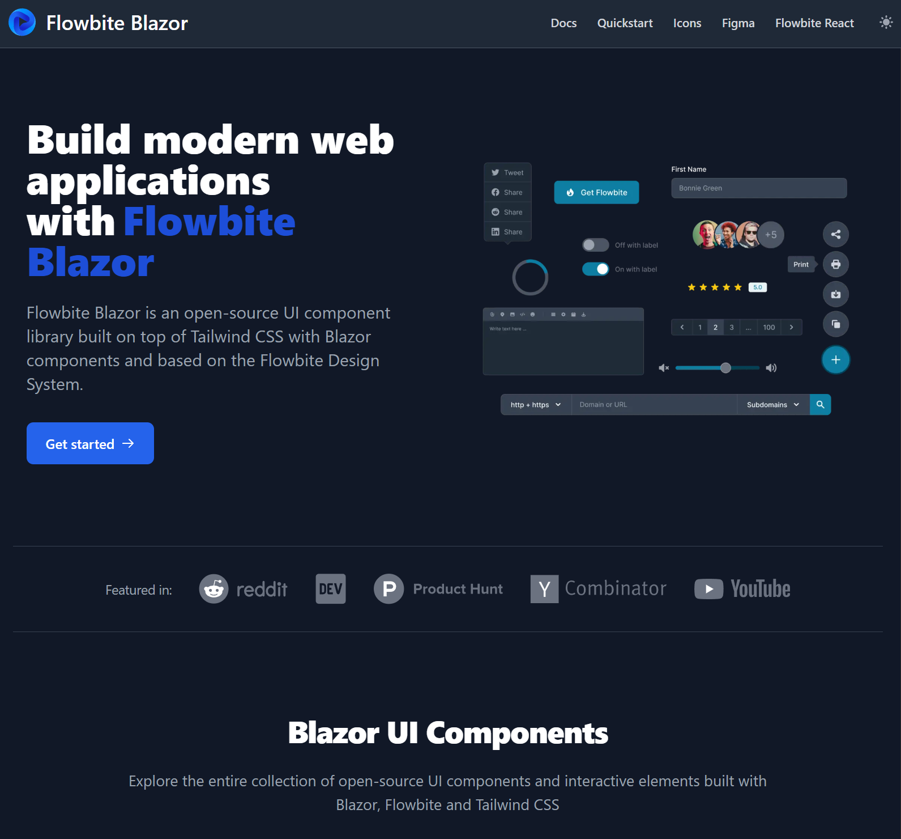

  <h1>🚧 Flowbite Blazor (unreleased) 🚧</h1>
  

    Build websites even faster with components on top of Blazor and Tailwind CSS
  

  

    
    
  

---

  

  

    
  

---

**⚠️ Flowbite Blazor is currently in early development and APIs and packages are likely to change quite often.**

## Flowbite Assembly

1. Icons
   - 90 core icons

1. Components
   - Alert
   - Avatar
   - Badge
   - Breadcrumb
   - Button
   - Card
   - Dropdown
   - Form Components
       - TextInput
       - TextArea
       - Select
       - Checkbox
       - Radio
       - FileInput
       - ToggeSwitch
       - RangeSlider
   - Modal
   - Icons
   - Navbar
   - QuizGrid
   - Sidebar
   - Spinner
   - Tooltip
   - more coming soon...

## Other Assemblies

| Assembly                | Description                                              |
| ----------------------- | -------------------------------------------------------- |
| Flowbite.ExtendedIcons  | 200+ Additional icons not found in Flowbite Blazor Core  |
| Flowbite.Templates.Wasm | .NET Project Templates for Blazor WebAssembly Standalone |

# AI-Supported Development Tools

- `llms-ctx.md` <https://flowbite-blazor.peakflames.org/llms-ctx.md> 🤖
    - Provide this URL to your AI-powered code assistant to give it knowledge about Flowbite Blazor.

# URL

<https://flowbite-blazor.org/>
